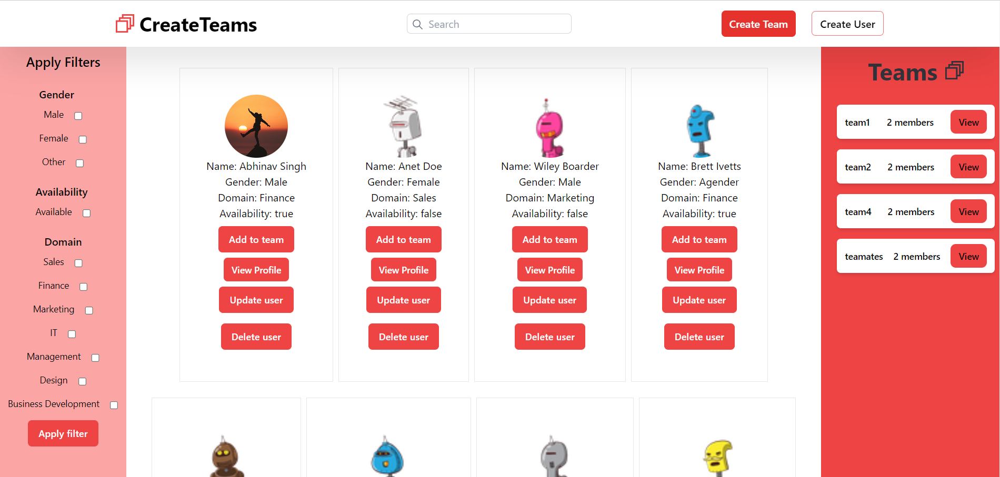
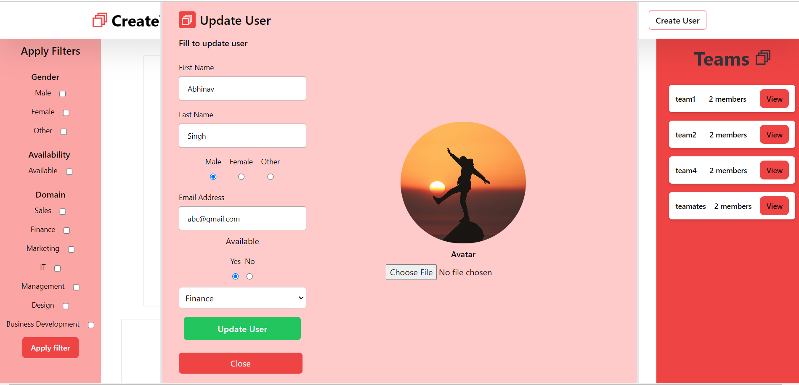
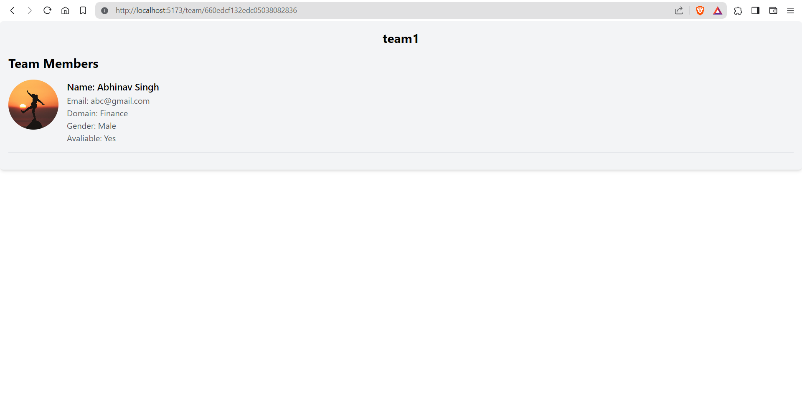
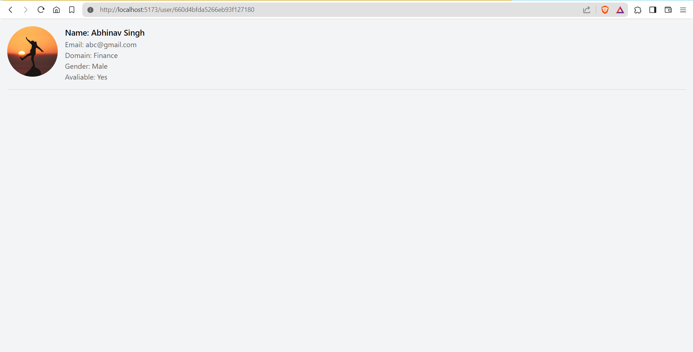

# Team Creator Web Application

This web application allows users to create teams by selecting users from a list displayed on the home page. Users can filter the list based on various criteria such as domain, availability, and gender.

## Live Link

Visit the application [here](#).

## Table of Contents

- [Features](#features)
- [Technologies Used](#technologies-used)
- [Visual Appearance](#visual-appearance)
- [Setup Instructions](#setup-instructions)
- [Usage](#usage)
- [API Docs](#api-docs)
- [Contributors](#contributors)
- [License](#license)

## Features

- **User List**: Displays a list of users on the home page.
- **Team Creation**: Users can select users from the list to create a team.
- **Team Information**: Each team consists of a team name and team members.
- **Filter Functionality**: Users can filter the user list based on domain (design, IT, management), availability (yes or no), and gender.
- **Department Constraint**: Teams can only be created using users who are available and do not belong to the same department.
- **Pagination**: Pagination functionality is implemented to display 20 users per page.

## Technologies Used

- Frontend: React.js, Redux Toolkit, Tailwind CSS
- Backend: Node.js, Express.js
- Database: MongoDB, Mongoose for ODM

## Visual Appearance

## Setup Instructions

1. Clone the repository.
2. Install dependencies for both client and server using `npm install`.
3. Start the frontend server using `npm run dev` in the client directory.
4. Start the backend server using `npm run dev` in the server directory.
5. Access the application via the provided URL in the terminal.

## Usage

1. Navigate to the home page.
2. Filter the user list based on your criteria.
3. Select users from the list by clicking on the add to team button.
4. Click on the create team button to create a team.
5. Provide a team name.
6. Save the team by clicking on confirm button.
7. View the team information on the side of home page also to see the details of team click on the view.
8. To see the details of a specific user click on the view profile button.

## API Docs

The API documentation for this project can be found [here](#).

## Contributors

- Abhinav Singh
- Contributions are welcome. Please create a pull request.

## License

This project is licensed under the [MIT License](LICENSE).
